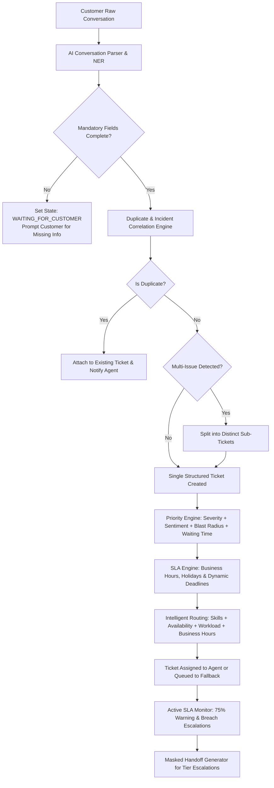

# AI-Powered Customer Support Ticket Workflow: Architecture & Refinement Specification

## 1. Executive Overview

This document specifies the refined engineering architecture for an enterprise-grade **AI-Powered Customer Support Ticket Management Workflow**. The system ingests unstructured, messy multi-channel customer communications, normalizes them through conversational AI parsers, and drives them through an automated lifecycle:



---

## 2. Ticket Data Model Specification

The ticket data model is structured into modular components: Identity, Customer & Order Information, Issue Classification, Priority Vectors, Routing & Assignment, SLA Tracking, Relationship Topology, and Audit Ledger.

### 2.1 Formal JSON Schema Definition

```json
{
  "$schema": "http://json-schema.org/draft-07/schema#",
  "title": "CustomerSupportTicket",
  "type": "object",
  "required": [
    "ticketId",
    "status",
    "customer",
    "issue",
    "priority",
    "sla",
    "routing",
    "auditTrail",
    "createdAt",
    "updatedAt"
  ],
  "properties": {
    "ticketId": { "type": "string", "pattern": "^TCK-[0-9]{8}-[0-9]{4}$" },
    "parentIncidentId": { "type": ["string", "null"] },
    "duplicateOfTicketId": { "type": ["string", "null"] },
    "splitFromTicketId": { "type": ["string", "null"] },
    "childTicketIds": { "type": "array", "items": { "type": "string" } },
    
    "status": {
      "type": "string",
      "enum": [
        "DRAFT",
        "WAITING_FOR_CUSTOMER",
        "TRIAGED",
        "QUEUED",
        "ASSIGNED",
        "IN_PROGRESS",
        "ESCALATED_L1",
        "ESCALATED_L2",
        "RESOLVED",
        "CLOSED",
        "MERGED"
      ]
    },

    "customer": {
      "type": "object",
      "required": ["customerId", "name", "contact"],
      "properties": {
        "customerId": { "type": "string" },
        "name": { "type": "string" },
        "tier": { "type": "string", "enum": ["STANDARD", "SILVER", "GOLD", "ENTERPRISE"], "default": "STANDARD" },
        "contact": {
          "type": "object",
          "required": ["preferredChannel"],
          "properties": {
            "email": { "type": ["string", "null"], "format": "email" },
            "phone": { "type": ["string", "null"] },
            "preferredChannel": { "type": "string", "enum": ["EMAIL", "PHONE", "CHAT", "WHATSAPP"] }
          }
        }
      }
    },

    "order": {
      "type": ["object", "null"],
      "properties": {
        "orderId": { "type": "string" },
        "productId": { "type": "string" },
        "productName": { "type": "string" },
        "purchaseDate": { "type": "string", "format": "date-time" },
        "deliveryStatus": { "type": "string" },
        "orderValue": { "type": "number" },
        "currency": { "type": "string", "default": "USD" }
      }
    },

    "issue": {
      "type": "object",
      "required": ["category", "summary", "rawText", "evidence"],
      "properties": {
        "category": {
          "type": "string",
          "enum": [
            "DELIVERY",
            "PAYMENT",
            "REFUND",
            "DAMAGED_PRODUCT",
            "WRONG_PRODUCT",
            "AUTHENTICATION",
            "TECHNICAL_DEFECT",
            "CANCELLATION",
            "ACCOUNT_MANAGEMENT",
            "GENERAL_INQUIRY"
          ]
        },
        "subcategory": { "type": "string" },
        "summary": { "type": "string" },
        "rawText": { "type": "string" },
        "extractedEntities": {
          "type": "object",
          "additionalProperties": { "type": "string" }
        },
        "evidence": {
          "type": "array",
          "items": {
            "type": "object",
            "required": ["type", "reference"],
            "properties": {
              "type": { "type": "string", "enum": ["PHOTO", "RECEIPT", "SCREENSHOT", "PREVIOUS_TICKET", "CHAT_LOG"] },
              "reference": { "type": "string" },
              "verified": { "type": "boolean", "default": false }
            }
          }
        },
        "missingMandatoryFields": {
          "type": "array",
          "items": { "type": "string" }
        }
      }
    },

    "priority": {
      "type": "object",
      "required": ["level", "calculatedScore", "factors"],
      "properties": {
        "level": { "type": "string", "enum": ["CRITICAL", "HIGH", "MEDIUM", "LOW"] },
        "calculatedScore": { "type": "number", "minimum": 0, "maximum": 100 },
        "factors": {
          "type": "object",
          "required": ["severityScore", "sentimentScore", "waitingTimeScore", "impactScore"],
          "properties": {
            "severityScore": { "type": "number", "description": "0-100 scale" },
            "sentimentScore": { "type": "number", "description": "0 (positive) to 100 (extreme frustration)" },
            "waitingTimeScore": { "type": "number", "description": "Normalized wait duration weight" },
            "impactScore": { "type": "number", "description": "Single customer (10) vs Platform outage (100)" }
          }
        },
        "manualOverride": { "type": "boolean", "default": false }
      }
    },

    "sla": {
      "type": "object",
      "required": [
        "ruleId",
        "targetBusinessMinutes",
        "warningThresholdMinutes",
        "slaDeadline",
        "consumedBusinessMinutes",
        "warningTriggered",
        "breached"
      ],
      "properties": {
        "ruleId": { "type": "string" },
        "targetBusinessMinutes": { "type": "integer" },
        "warningThresholdMinutes": { "type": "integer" },
        "slaDeadline": { "type": "string", "format": "date-time" },
        "warningDeadline": { "type": "string", "format": "date-time" },
        "consumedBusinessMinutes": { "type": "integer" },
        "remainingBusinessMinutes": { "type": "integer" },
        "warningTriggered": { "type": "boolean" },
        "breached": { "type": "boolean" },
        "escalationLevel": { "type": "integer", "default": 0 },
        "lastRecalculatedAt": { "type": "string", "format": "date-time" }
      }
    },

    "routing": {
      "type": "object",
      "required": ["requiredSkills", "teamId"],
      "properties": {
        "teamId": { "type": "string" },
        "assignedAgentId": { "type": ["string", "null"] },
        "requiredSkills": { "type": "array", "items": { "type": "string" } },
        "routingStrategy": { "type": "string", "enum": ["SKILL_LOAD_BALANCED", "ROUND_ROBIN", "BACKUP_ESCALATION", "FALLBACK_QUEUE"] },
        "assignmentHistory": {
          "type": "array",
          "items": {
            "type": "object",
            "properties": {
              "agentId": { "type": "string" },
              "assignedAt": { "type": "string", "format": "date-time" },
              "reassignedReason": { "type": "string" }
            }
          }
        }
      }
    },

    "auditTrail": {
      "type": "array",
      "items": {
        "type": "object",
        "required": ["timestamp", "actor", "action", "details"],
        "properties": {
          "timestamp": { "type": "string", "format": "date-time" },
          "actor": { "type": "string" },
          "action": { "type": "string" },
          "fromState": { "type": "string" },
          "toState": { "type": "string" },
          "details": { "type": "string" }
        }
      }
    },

    "createdAt": { "type": "string", "format": "date-time" },
    "updatedAt": { "type": "string", "format": "date-time" }
  }
}
```

---

## 3. SLA Engine Design & Mathematical Formulation

### 3.1 Business Time Arithmetic & Interval Mapping

Let calendar time be represented as continuous UTC timestamps $t$.
A tenant's operating calendar is defined by the tuple:
$$\mathcal{C} = \left( \mathcal{Z}, \mathcal{W}, \mathcal{H}, \mathcal{S} \right)$$
where:
- $\mathcal{Z}$: Local timezone identifier (e.g. `America/New_York`, `Asia/Kolkata`).
- $\mathcal{W} \subset \{0, 1, 2, 3, 4, 5, 6\}$: Set of non-working weekend days ($0=\text{Sunday}, 6=\text{Saturday}$).
- $\mathcal{H} = \{d_1, d_2, \dots, d_m\}$: Set of full or partial holiday dates.
- $\mathcal{S} = [T_{\text{start}}, T_{\text{end}}]$: Daily working shift interval (e.g., $09:00 \to 18:00$).

#### Business Window Membership Function
For any minute interval $[t, t + \Delta t)$, the business validity indicator $\chi(t) \in \{0, 1\}$ is:
$$\chi(t) = 1 \iff \left( \text{DayOfWeek}(t, \mathcal{Z}) \notin \mathcal{W} \right) \land \left( \text{Date}(t, \mathcal{Z}) \notin \mathcal{H} \right) \land \left( T_{\text{start}} \le \text{TimeOfDay}(t, \mathcal{Z}) < T_{\text{end}} \right)$$

### 3.2 Target Calculation Algorithm
Given ticket creation timestamp $t_0$ and target SLA duration $D_{\text{target}}$ (in business minutes):
1. **Snap to Shift**: If $\chi(t_0) = 0$ (ticket submitted off-hours, weekend, or holiday), advance $t_0$ to the immediate next valid business minute $t_0'$. No business time is consumed during the waiting period prior to $t_0'$.
2. **Integration / Step Calculation**:
   Find $t_{\text{deadline}}$ such that:
   $$\int_{t_0'}^{t_{\text{deadline}}} \chi(\tau) \, d\tau = D_{\text{target}}$$
3. **75% Warning Threshold**:
   Find $t_{\text{warning}}$ such that:
   $$\int_{t_0'}^{t_{\text{warning}}} \chi(\tau) \, d\tau = \lfloor 0.75 \times D_{\text{target}} \rfloor$$

### 3.3 Dynamic Recalculation on Policy or Calendar Mutation
When an administrative change occurs at runtime $t_{\text{mut}}$ (e.g., target SLA changes from 8h to 4h, or a new holiday is inserted):
1. Compute consumed business minutes from ticket inception up to $t_{\text{mut}}$:
   $$D_{\text{consumed}} = \int_{t_0'}^{t_{\text{mut}}} \chi_{\text{old}}(\tau) \, d\tau$$
2. Compute remaining required business minutes under new policy $D_{\text{target}}^{\text{new}}$:
   $$D_{\text{remaining}} = \max\left(0, D_{\text{target}}^{\text{new}} - D_{\text{consumed}}\right)$$
3. If $D_{\text{remaining}} = 0$, immediately trigger SLA breach and escalation.
4. Otherwise, compute the new deadline $t_{\text{deadline}}^{\text{new}}$ starting from $t_{\text{mut}}$ using the updated calendar $\chi_{\text{new}}(\tau)$:
   $$\int_{t_{\text{mut}}}^{t_{\text{deadline}}^{\text{new}}} \chi_{\text{new}}(\tau) \, d\tau = D_{\text{remaining}}$$

---

## 4. Hidden-Test Scenarios Matrix

Evaluators test resilience against edge cases, race conditions, calendar anomalies, and multi-issue complexities. The table below lists the 8 core hidden-test scenarios and strict acceptance assertions:

| ID | Test Scenario | Input Vector | Expected State & Workflow Action | Failure Condition |
|---|---|---|---|---|
| **HT-01** | **Duplicate Ticket Detection (Conversational Flurry)** | User sends message 1: *"Order #ORD4521 missing"*. 8 mins later, user sends: *"Still no update on #ORD4521 laptop!"* | System identifies Customer ID + Order ID match + identical intent. Appends message 2 to existing Ticket #101 instead of generating Ticket #102. Audit trail records `DUPLICATE_MERGE`. | Spurious second ticket created; agent workload artificially doubled. |
| **HT-02** | **Team Offline & Skills-Based Fallback Routing** | Critical Payment failure arrives; Payment Tier 1 agents are all offline or at max capacity (workload = 100%). | Router identifies skill deficit, falls back to Level 2 On-Call / Escalation Team or places in priority `FALLBACK_QUEUE` with immediate alert. Never assigns to offline agent. | Ticket assigned to offline agent who cannot respond; SLA breaches silently. |
| **HT-03** | **After-Hours & Weekend Boundary SLA** | High-priority ticket (8 business hrs) submitted Friday at 17:30. Shift is Mon-Fri 09:00-18:00. Weekend: Sat/Sun. | Friday consumes 30 mins (17:30-18:00). Saturday/Sunday consume 0 mins. Monday consumes 7.5 hrs (09:00-16:30). SLA Deadline = **Monday 16:30**. 75% warning at **Monday 14:30** (6 business hrs). | Calculation uses wall-clock time and marks deadline as Saturday 01:30 AM. |
| **HT-04** | **Runtime Holiday Calendar Injection** | Ticket created Friday 17:30. Over the weekend, admin declares Monday a national holiday (e.g., Oct 2 Gandhi Jayanti). | SLA Engine invalidates cached deadline; recomputes Monday as 0 business hrs. Remaining 7.5 hrs roll over to Tuesday 09:00-16:30. New Deadline = **Tuesday 16:30**. | SLA triggers false warning/breach on Monday holiday. |
| **HT-05** | **Runtime SLA Compression (Target Shortening)** | Ticket has 8 business hrs SLA. 5 business hrs elapse. Admin adjusts Critical policy SLA to 4 business hrs. | Engine calculates $D_{\text{consumed}} = 5 \text{ hrs} > D_{\text{target}}^{\text{new}} (4 \text{ hrs})$. System transitions immediately to `ESCALATED_L1`, flags `breached=True`, and dispatches escalation webhook. | System maintains stale 8h deadline or crashes with negative time. |
| **HT-06** | **Missing Mandatory Information State Machine** | Customer says: *"My package arrived smashed! Please replace."* No Order ID provided. | Issue category is `DAMAGED_PRODUCT` (requires `orderId`). State becomes `WAITING_FOR_CUSTOMER`. System generates prompt for Order ID. SLA clock paused/conditional. When customer replies with `#ORD-991`, state becomes `TRIAGED` and routing activates. | Ticket assigned without order ID, or ticket dropped into void. |
| **HT-07** | **Multi-Issue Splitting vs Master Incident Grouping** | **A)** *"Late delivery of shoes AND my account password reset link is broken."*<br/>**B)** 50 individual users within 10 minutes report *"Payment gateway error 502"*. | **A)** Splits into Ticket 1 (`DELIVERY` $\to$ Logistics Team) and Ticket 2 (`AUTHENTICATION` $\to$ IT/Auth Team).<br/>**B)** Correlates all 50 tickets under `Incident-5001` (Impact score maxed to 100, Priority escalated to `CRITICAL`). | Blending two distinct issues into one ticket causing cross-team ping-pong; or failing to recognize platform outage. |
| **HT-08** | **Masked Handoff with Strict PII Redaction** | Escalating ticket containing credit card `4532-1188-9923-8812`, phone `+1-555-839-2019`, and email `customer@corp.com`. | Handoff summary produces masked representations: `****-****-****-8812`, `******2019`, `c*******@corp.com`. All operational details (issue, priority, reason) preserved. | Plaintext sensitive PII leaked into handoff notes across internal teams. |
